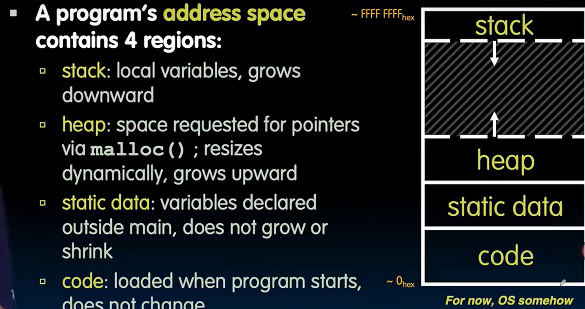
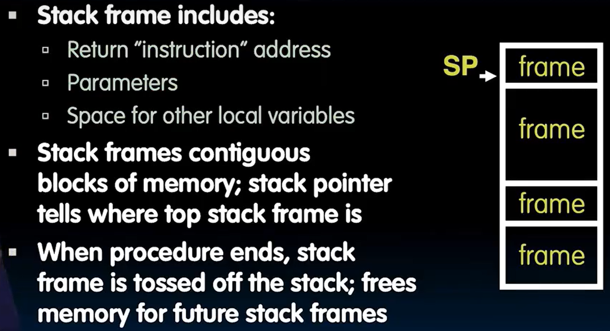

# Memory Management

```c
void foo() {
    int *p, *q, x;
    int a[4];
    p = (int *) malloc (sizeof(int));
    q = &x;

    *p = 1; // p[0] would also work here
    printf("*p:%u, p:%u, &p:%u\n", *p, p, &p);

    *q = 2; // q[0] would also work here
    printf("*q:%u, q:%u, &q:%u\n", *q, q, &q);

    *a = 3; // a[0] would also work here
    printf("*a:%u, a:%u, &a:%u\n", *a, a, &a);
}
```


The content `p` pointing to is `1` and address `p` pointing to is `40` while the address of `p` is `12`


## Linked List

```c
struct Node {
    char *value;
    struct Node *next;
};
typedef struct Node *List;
```

add a string to an existing list

```c
List list_add(List list, char *string)
{
    struct Node *node = (struct Node*) malloc(sizeof(struct Node)); // allocate memory for a new node
    node->value = (char*) malloc(strlen(string) + 1); // allocate memory for string (includes \0 representing the end
    strcpy(node->value, string); // char *strcpy(char *dest, const char *src);
    node->next = list;
    return node;
}
```


## Memory locations

- **Static storage**: global variable storage, basically permanent, entire program run
- **The Stack**: local variable storage, parameters, return address (location of "activation records" in Java or "stack frame" in C)
- **The Heap** (dynamic malloc storage): data lives until deallocated by programmer






## Memory Management

`malloc` searchs the free lists for a block that is big enough. ( takes time

`free()` checks if the blocks adjacent to the freed block are also free.

- if so adjacent free blocks are merged
- otherwise, free block is just added to the free list

## When memory goes bad

```c
int *foo = (int *) malloc(sizeof(int) * 100);
int i;
...
for(i = 0; i <= 100; ++i) {
    foo[i] = 0;
}
```

```c
int *ptr() {
    int y;
    y = 3;
    return &y; // 返回y的地址
}

main() {
    int *stackAddr, content;
    stackAddr = ptr();
    content = *stackAddr;
    printf("%d", content);     // 第一次打印 3
    content = *stackAddr;
    printf("%d", content);     // 第二次打印 13451514
}
```

After calling `ptr()` , the local variable `y` has "expired," but its content might not have been overwritten yet.

At this point, `*stackAddr` may still read the old value of `y`.

However, before executing the second `printf`, the stack space might be overwritten or reused by subsequent function calls (like `printf`) or other operations.

**Never return the address of a local (stack) variable.**

